================================================================================
Orientation detection results and evaluation
================================================================================

Quantitative results
---------------------

`Cropped whale shark test set <https://wildbookiarepository.azureedge.net/data/pie_v2.whale_shark_cropped_demo.zip>`_
contains 333 unique spot patterns.
Each pattern have from 2 to 5 sightings.
During evaluation, each image is matched against the rest so each query image has at most 4 matches.

Accuracy
==========
Accuracy of retrieval 1-vs-all is reported.
Rank-k means that a correct match is returned within top-k predictions.

+----------------------+---------------+--------------+--------------+--------------+
| Dataset              |    Rank 1     |    Rank 5    |    Rank 10   |    Rank 20   |
+======================+===============+==============+==============+==============+
| Whale shark cropped  |     81.5%     |    89.5%     |    91.7%     |    94.7%     |
+----------------------+---------------+--------------+--------------+--------------+
| Whale Grey           |     69.5%     |    81.4%     |    85.3%     |    90.2%     |
+----------------------+---------------+--------------+--------------+--------------+
| Wild horse           |     32.8%     |    53.4%     |    63.9%     |    71.8%     |
+----------------------+---------------+--------------+--------------+--------------+

Qualitative results
--------------------

First image in each row is a query image.
The next five images are the top-5 retrieved matches from the test set.

Green border - correct match, red border - incorrect match.

Whale Shark cropped
====================

.. figure:: ../examples/000000000019_0.jpg
   :align: center

.. figure:: ../examples/000000000050_0.jpg
   :align: center

.. figure:: ../examples/000000000104_0.jpg
   :align: center

.. figure:: ../examples/000000000127_0.jpg
   :align: center

.. figure:: ../examples/000000000142_0.jpg
   :align: center

.. figure:: ../examples/000000000182_0.jpg
   :align: center

Whale Grey
====================

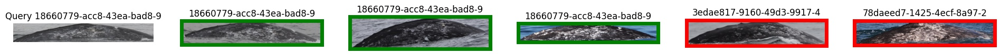

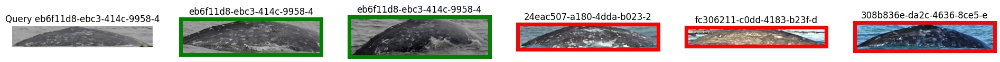

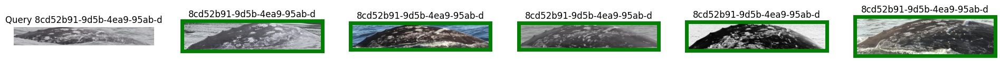

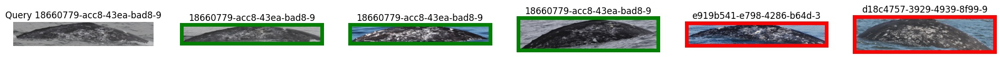

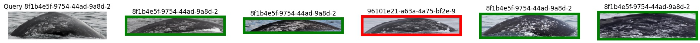

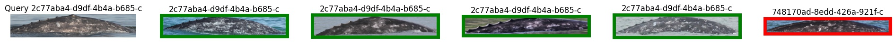

Wild horse
====================

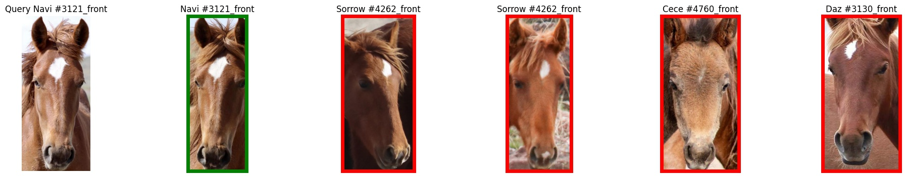

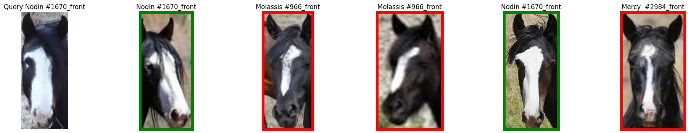

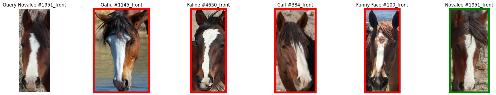

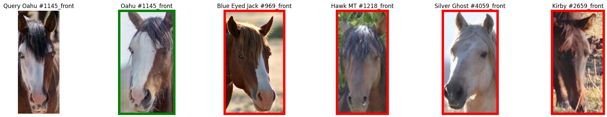

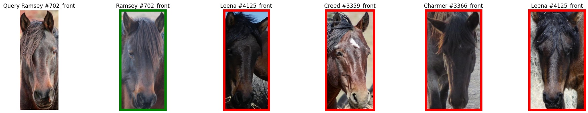

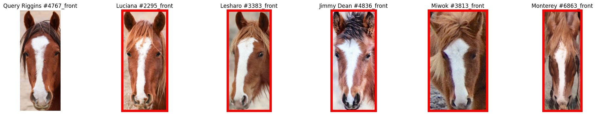

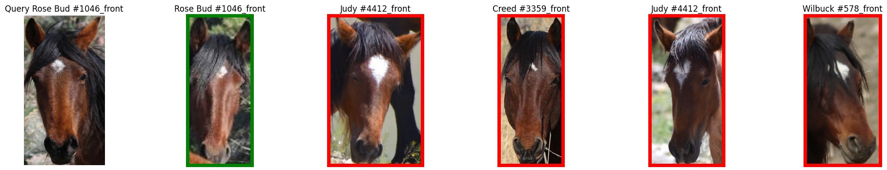
